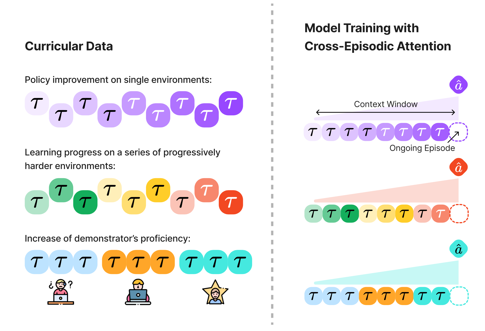

# Cross-Episodic Curriculum for Transformer Agents
## NeurIPS 2023
<div align="center">

[[Website]](https://cec-agent.github.io/)
[[arXiv]]()
[[PDF]]()
[[Installation]](#Installation)
[[Training]](#Training)
[[Evaluation]](#Evaluation)
[[BibTex]](#Paper-and-Citation)

[](https://cec-agent.github.io/)
[](https://pytorch.org/)
[](https://github.com/cec-agent/CEC/blob/main/LICENSE)
______________________________________________________________________

</div>

We present a new algorithm, Cross-Episodic Curriculum (CEC), to boost the learning efficiency and generalization of Transformer agents. Central to CEC is the placement of cross-episodic experiences into a Transformer’s context, which forms the basis of a curriculum. By sequentially structuring online learning trials and mixed-quality demonstrations, CEC constructs curricula that encapsulate learning progression and proficiency increase across episodes. Such synergy combined with the potent pattern recognition capabilities of Transformer models delivers a powerful cross-episodic attention mechanism. The effectiveness of CEC is demonstrated under two representative scenarios: one involving multi-task reinforcement learning with discrete control, such as in DeepMind Lab, where the curriculum captures the learning progression in both individual and progressively complex settings; and the other involving imitation learning with mixed-quality data for continuous control, as seen in RoboMimic, where the curriculum captures the improvement in demonstrators' expertise. In all instances, policies resulting from CEC exhibit superior performance and strong generalization.

In this repo, we provide CEC implementation and our training and evaluation pipeline. This codebase is under [MIT License](LICENSE).

# Installation
CEC requires Python == 3.8. Installing our codebase is as simple as:

```bash
pip install git+https://github.com/cec-agent/CEC
```

## Setup Environments
We conducted experiments on DeepMind Lab and RoboMimic. Please follow instructions to setup [DMLab](https://github.com/google-deepmind/lab), [Sample Factory](https://github.com/alex-petrenko/sample-factory), [robosuite](https://github.com/ARISE-Initiative/robosuite), and [RoboMimic](https://github.com/ARISE-Initiative/robomimic).

# Training
## Data Preparation
Our method is trained offline in a supervised manner. We generated training data for DMLab tasks. This dataset can be downloaded from [🤗HuggingFace](https://huggingface.co/datasets/cec-neurips23/data). To download robomimic dataset, please follow the [instruction](https://robomimic.github.io/docs/datasets/overview.html) to download **MH** datasets.

## Train DMLab
In the repository, launch the following command to start training on DMLab.

```bash
python3 main/dmlab/train.py --method={METHOD} --task={TASK} --gpus={GPU} --data_path={DATA_PATH}
```

`METHOD` can be one of `cec`, `at`, and `dt`. `TASK` can be `TASK_NAME/SETTING`. Here `TASK_NAME` is one from `goal_maze`, `watermaze`, and `irreversible_path`. All possible `SETTING`s can be found in corresponding [config folder](https://github.com/cec-agent/CEC/blob/main/cec/main/dmlab/train_config/task). `DATA_PATH` is the path to unzipped DMLab training data. Specify `GPU` following [here](https://lightning.ai/docs/pytorch/stable/common/trainer.html#accelerator).

## Train robomimic
In the repository, launch the following command to start training on robomimic.

```bash
python3 main/robomimic/train.py --task={TASK} --gpus={GPU} --data_path={DATA_PATH}
```
`TASK` can be one of `lift` and `can`. `DATA_PATH` is the path that stores robomimic `.h5py` files. Specify `GPU` following [here](https://lightning.ai/docs/pytorch/stable/common/trainer.html#accelerator).

# Evaluation
## Evaluate on DMLab
Given a checkpoint at at `CKPT_PATH`, run the following command to evaluate on DMLab.

```bash
python3 main/dmlab/test.py --ckpt_path=CKPT_PATH --method={METHOD} --task={TASK}
```

Specifying `METHOD` and `TASK` is similar to the training script.

## Evaluate on robomimic
Given a checkpoint at at `CKPT_PATH`, run the following command to evaluate on robomimic.

```bash
python3 main/robomimic/test.py --ckpt_path=CKPT_PATH --task={TASK} --data_path={DATA_PATH}
```

`TASK` can be one of `lift` and `can`. We need to read env meta info stored in training data to instantiate the test environments.

# Paper and Citation

Our paper is posted on [arXiv](). If you find our work useful, please consider citing us! 

```bibtex
@inproceedings{shi2023cross,
    title     = {Cross-Episodic Curriculum for Transformer Agents},
    author    = {Lucy Xiaoyang Shi and Yunfan Jiang and Jake Grigsby and Linxi Fan and Yuke Zhu},
    booktitle = {Thirty-seventh Conference on Neural Information Processing Systems},
    year      = {2023},
    url       = {https://openreview.net/forum?id=afKnrwJBAl}
}
```
